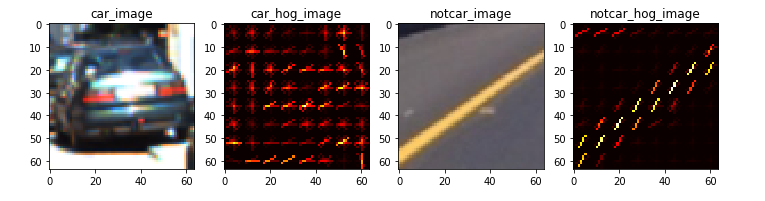
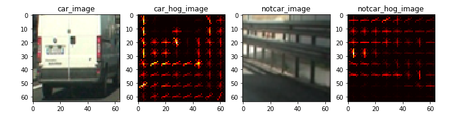
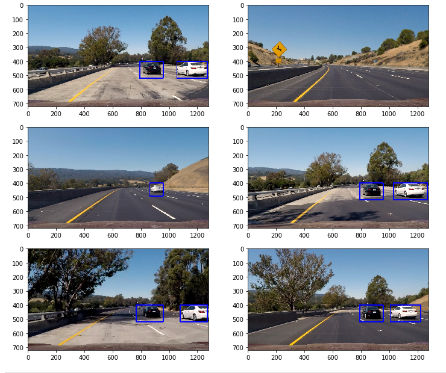

### Vehicle Detection Project

The goals / steps of this project are the following:

* Perform a Histogram of Oriented Gradients (HOG) feature extraction on a labeled training set of images and train a classifier Linear SVM classifier
* Optionally, you can also apply a color transform and append binned color features, as well as histograms of color, to your HOG feature vector.
* Note: for those first two steps don't forget to normalize your features and randomize a selection for training and testing.
* Implement a sliding-window technique and use your trained classifier to search for vehicles in images.
* Run your pipeline on a video stream (start with the test_video.mp4 and later implement on full project_video.mp4) and create a heat map of recurring detections frame by frame to reject outliers and follow detected vehicles.
* Estimate a bounding box for vehicles detected.

---

### Histogram of Oriented Gradients (HOG)

**1. Explain how (and identify where in your code) you extracted HOG features from the training images.**

I use a series of functions combined with their properties into a function called `extract_features()` (lesson_functions.py line 52) to extract HOG features from the training images.  The steps consists of computing the gradient image in x and y coordinates to a chosen color space, computing the gradient histograms, normalizing the process and flattening everything into a feature vector.  The main algorithm utilized is scikit-image's `hog` feature that does the processing.  

Examples of the hog feature images:

**2. Explain how you settled on your final choice of HOG parameters.**

I increased the orientation value to have a greater distribution of gradient directions to slightly increase the classification elements.  It's difficult to visually identify the differences in the HOG feature image when you change the values, so my main decision criterion for the parameters was decided by the performance of the classifier I trained.  The hog images for cars clearly illustrates a shape resembling a car and for non-cars the directions of the gradients were more scattered and harder to identify. Having more hog channels should further define this element.  After testing, it appears that the choice of color space has the biggest impact in the performance of the model and `YCrCb` seemed to perform the best. Tuning the other parameters had little to no impact on the performance and thus were left as the default values showcased in the lessons.  

Final parameters:

|    Feature     | Parameter   |
|----------------|-------------|
| color space    |  YCrCb      |
| orient         |  11         |
| pix per cell   |  8          |
| cell per block |  2          |  
| hog channel    |  ALL        |
| spatial size   |  16, 16     |
| hist bins      |  16         |
| spatial feat   |  True       |
| hist feat      |  True       |
| hog feat       |  True       |

**3. Describe how (and identify where in your code) you trained a classifier using your selected HOG features (and color features if you used them).**

- I use scikit-learn's Linear Support Vector Classification (LinearSVC) to train my classifier (svc.py line 65).
- During this process, I apply `scikit-learn's` `StandardScaler` to standardize the features extracted by removing the mean and scaling to unit variance  
- By using `extract_features()` (lesson_functions.py line 52), I can extract and create arrays for the feature vectors and label vectors of the car and non-car datasets
- I randomize and split the arrays into training data and test data sets
- The LinearSVC function is executed in the end to train the model.
- The end result projected a 99% performance accuracy using the parameters above.  

---

### Sliding Window Search

**1. Describe how (and identify where in your code) you implemented a sliding window search.  How did you decide what scales to search and how much to overlap windows?**

A sliding window search is implemented in the 5th cell of my jupyter notebook, utilizing a slide_window, search_window, add_heat and labels function to identify the windows, heatmap and concatenating the results into a single unified box outlining the cars identified (the full structure of these functions can be found in the file lesson_functions.py).  

Most of the parameters were chosen after empirical testing.  It's important to have sufficient windows to identify the location of the cars while it is also important to limit the windows being searched to not drastically slow down the pipeline.  A search window size of 96x96 pixels seemed to identify the cars really well and draw boxes with a good proportion in size to match the cars found. Another benefit for 96x96 is that it covers more space in the image with each box thus increasing the performance speed.  An overlap value of 0.65 - 0.75 is able to correctly identify and draw a rectangle for the whole car while only decreasing the processing speed minimally.    

**2. Show some examples of test images to demonstrate how your pipeline is working.  What did you do to optimize the performance of your classifier?**

I limited the search window to exclude the skies and the area beyond the left divider to decrease the dead space and this also increases the speed of the pipeline by reducing the number of search windows.  One or two frames of false positives can appear in the shadow or on the trees and this can be filtered out by applying a heatmap threshold for boxes requiring 2 pixels or more to be present.

Test images pipeline:

---

### Video Implementation

**1. Provide a link to your final video output.  Your pipeline should perform reasonably well on the entire project video (somewhat wobbly or unstable bounding boxes are ok as long as you are identifying the vehicles most of the time with minimal false positives.)**

Here's a [link to my video result](./project_video_output.mp4)

**2. Describe how (and identify where in your code) you implemented some kind of filter for false positives and some method for combining overlapping bounding boxes.**

- For my video pipeline, I use a hog sub-sampling window search that is more efficient than a sliding window pipeline
- Reason being is that the hog features only have to be extracted once and sub-sampled to locate detected windows
- To increase the accuracy, I run a hog sub-sampling window search twice with different scales and area of interest to apply a more calculated search based on the size of the car that appears in the camera image
  - For cars in the middle of the image, I use a scale of 1 which is equivalent to a 64x64 search window
  - For cars in the middle and foreground of the image I use a scale of 1.5 which is equivalent to a 96x96 search window
  - Having more window searches may further improve accuracy but greatly sacrifices performance
  - Two window searches for vehicle detection seemed to be sufficient after testing
- I apply a heat threshold (lesson_functions.py line 270) to my second search iteration to filter out lesser detections bounding boxes and most likely false positives detected
- I import `deque` from the `collections` library to store a global variable of the running average of the last 10 frames and project a combination of heat boxes within those 10 frames
- Applying `scipy.ndimage.measurements.label` algorithm makes it easier concatenate all the heat boxes into one bounding box
- Together with deque and label, I am able to alleviate the unstableness of the bounding boxes and even out the detections

---

### Discussion

**1. Briefly discuss any problems / issues you faced in your implementation of this project.  Where will your pipeline likely fail?  What could you do to make it more robust?**

The main problems I faced was trying to maintain a smooth and static bounding boxes around the vehicles detected.  Visibility is a crucial factor for success.  Poor visibility due to contrast or lots of shadow can hinder the model, creating false positives or being unable to identify vehicles.  The whole process is also very time-consuming and inefficient in python in my opinion. Doing this in real time can introduce high delay caused by unwanted processing time.  There is also minimal false positives that appear for 1 or 2 frames but they are instantly corrected by the model.  

To make this project more robust, we should implement a prediction element where we identify/calculate the targeted vehicle, or number of vehicles, and track their speed and measured distance.  Once tracked we can draw a smooth prediction bounding box based on the parameters calculated, and check every few seconds to recalibrate their speeds/distance.  The processing speed for the video should also improve significantly. Furthermore, the bounding boxes drawn when two cars converges next to each other wouldn't merge, and false positives that aren't able to persist for more than a few frames would simply be filtered out.
